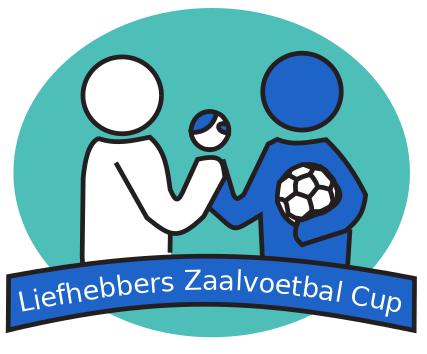

# Course Project for IDM
-------------------

## Overview

In this project assessment we are to submit a **team code and report** and **individual video** presentations on the problem of _designing complex sport game fixtures_. Our  system will need to be able to make decision regarding when, where, and how teams should play during a season. The domain will have specific hard and soft constraints that your decision making system would need to adhere too. There will be different level of achievements; see The Problem section below.

The overarching aim of this project is that you go _deep_ on the problem and that you are able to communicate the problem, results, and learning achieved, both written and orally. In doing so, we are expected to seek and read the relevant literature (e.g., scientific papers, manuals, technical reports, etc.), develop the necessary code, design, run and analyse experiments, integrate the content and findings, and report it all, both written and orally.

The project is composed of three submissions: proposal, report (with code), and video. Each component is be explained below. When in doubt, please ask the teaching staff in advance.

## The Problem

The project involves the [Scheduling the LZV Cup](https://robinxval.ugent.be/Research/indoor.php), a time-relaxed double round robin scheduling task for an amateur indoor football association. In a nutshell, you need to investigate how to use AI Declarative Programming to make effective decisions on designing sport tournaments.

 

    
 

There is a _core_ part of the project and an _extension_ part (for those aiming for DI/HD level).

**Note:** while not part of the core objective, the development of quality tools---e.g., for experiments, interaction, or visualisation---during the project will also be taken into account positively at evaluation/marking time.

## Deliverables

The project involves three submissions, as per dates and weights at the top of this file.

### 1. Project proposal

1. A high-level, but high-quality, explanation of the problem to be studied and tackled. This ma y include some initial relevant literature/sources to be used (although in the process more sources will be found and used).
2. An explanation of how the team will work together during the weeks until submission. This can include, but it is not limited to, division of tasks and/or cooperation, availability of members, strength and weakness of each member, schedules for meetings (once a week, twice a week; online, face-to-face, mixed, etc.), technologies to be used, agreed team dynamics and commitments, expectations, etc. This explanation should provide strong evidence that the team has seriously discussed the project together, what they will aim for, and how they will work together towards its success.
3. Signatures of each member at the end of the proposal, indicating that the member agrees with the proposal (and was active in building it).

The PDF proposal is to be committed and pushed into the `main` branch of this GitHub repository as a file `proposal.pdf` and with the corresponding git commit tag `proposal`. The file should be placed in the root of the repo.

### 2. Project code & report

The report itself will be the main output of the assessment, together with the accompanying code and experiments. The report is named `report.pdf`, and the commit  done in the `main` branch with corresponding tag `final`. The file is  placed in the root of the repo.

The report is  a technical one.

Regarding the code,  solution  include scripts to read instance encodings and produce calendars in the standard format,  in Python, which integrates nicely with Clingo, explained clearly in the report how your system is to be used, including using those scripts.

In  repo, created our own folders where we can save all the relevant material for the project, including code, relevant papers, experimental data and results, source code of report, etc.

## Conclusions

This is the end of the project assessment specification.

